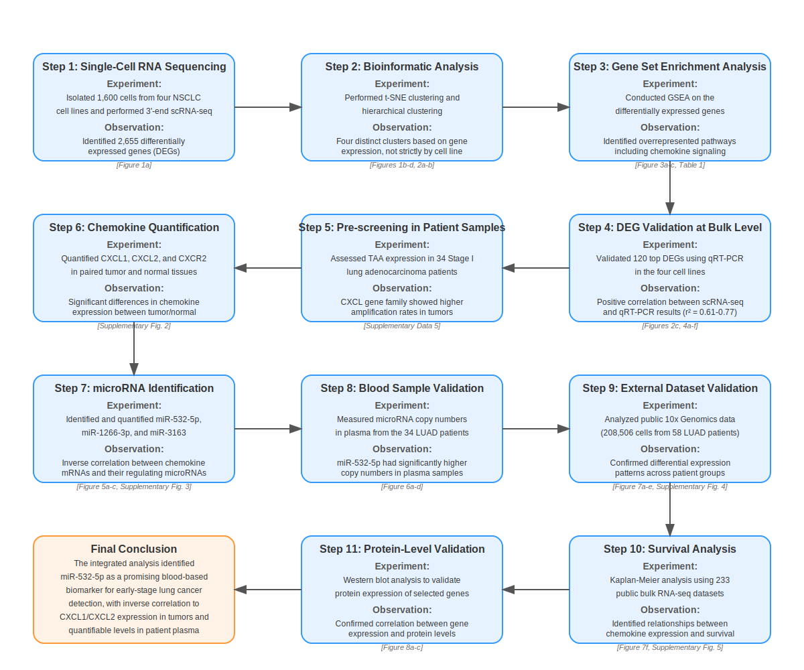

# Single-Cell RNA-Seq Analysis Guide: From FASTQ to DEGs

## To Do's for this Guide

 - I want to adjust it so I can run the analysis and processing on the cloud (still using Docker containers).
 - The part about ASAP/CPM is missing.
 - I want to add a 'Further Investigation' section about what else can be done with the data or other analysis that could be done.
 - The whole processing and visualization of up/down-regulation needs work.
 - I had significant help from Claude Sonnet 3.7 for the R portions of this document because it's not my forté. I want to properly review and clean it later.

## Introduction

This guide will walk us through analyzing single-cell RNA sequencing (scRNA-seq) data from [GSE183590](https://www.ncbi.nlm.nih.gov/geo/query/acc.cgi?acc=GSE183590), a dataset from the paper [Single-cell RNA sequencing for the identification of early-stage lung cancer biomarkers from circulating blood](https://www.nature.com/articles/s41525-021-00248-y). 

(I'm a newbie to bioinformatics and molecular biology so please pardon my mistakes. I'm updating this document as I go.)

We'll learn how to process FASTQ files, cluster cell types, visualize the data, and identify differentially expressed genes (DEGs).

We'll use Docker containers to manage the software environment, making it easier to run tools without installing them directly on our system.

### Prerequisites

- Basic knowledge of command line interface
- Docker should be installed (Dockerfiles are included in repo)
- The FASTQ files we've already downloaded and processed from SRA, and metadata

### Overview of Experiment Workflow

This diagram represents the experiments and observations completed in the paper as I understand them.



### What's Covered in this Exercise

This exercise aims to cover Steps 1 and 2 in the Experiment Workflow above.
Within those steps, we'll handle the following tasks:

1. Setup and Preparation
2. Raw Data Processing
3. Exploratory Data Analysis
4. Cell Clustering and Annotation 
5. Differential Expression Analysis
6. Saving and Exporting Results

Let's begin!

## 1. Setup and Preparation

### Project Directory Structure

Before we begin, let's establish a clear directory structure for our project. This will help keep our analysis organized and make it easier to track our progress.

```
/deg-practice/                     # Main project directory
├── data/                          # Contains all our FASTQ files and the reference genome
│   ├── SRR15740035.fastq.gz
│   ├── SRR15740036.fastq.gz
│   ├── ...
│   └── counts.txt                 # Counts matrix
├── metadata/                      # GEO metadata files
│   ├── GSE183590_family.soft.gz   # SOFT format metadata
│   └── GSE183590_family.xml.gz    # MINiML format metadata
├── reference/                     # Reference genome files
│   ├── GRCh38.p13.fa              # Reference genome in gzipped FASTA format
│   ├── annotation.gtf             # Annotation file for featureCount
│   └── ...
├── fastqc_results/                # Quality control results (optional)
│   ├── SRR15740035_fastqc.html
│   ├── SRR15740035_fastqc.zip
│   └── ...
├── seurat_analysis.rds            # Saved Seurat object
├── cell_clusters.csv              # Cluster assignments
├── umap_coordinates.csv           # UMAP coordinates for visualization
├── top_markers.csv                # Top marker genes by cluster
└── all_degs.csv                   # All differentially expressed genes
```

This structure separates our data by function and keeps processed results separate from raw data. We'll create these directories as needed throughout the analysis.

### Setting Up a Docker Environment for scRNA-seq Analysis

Instead of installing various tools, let's create a reproducible Docker environment with all the necessary software for scRNA-seq analysis:

Check that we have the Dockerfiles, `Dockerfile` and `Dockerfile.eutils`.

Build the primary Docker image:
```
docker build -t scrnaseq-analysis:1.0 .

# or if using MacOS with mX chips:
docker build --platform linux/arm64 -t scrnaseq-analysis:1.0 .
```

Verify the image was built successfully
```
docker images | grep scrnaseq-analysis
```

Take a look at the docker-compose.yml file understand the analysis environment a little better.
To run our analysis environment using docker-compose:

```bash
# Start the container and enter an interactive R session
docker-compose run --rm analysis R

# Or for an interactive bash shell
docker-compose run --rm analysis bash
```

To exit or stop our Docker container when using docker-compose, we have a few options:

If we're in an interactive R session:
1. Type `q()` and press Enter
2. When prompted "Save workspace image?", type `n` (or our preference) and press Enter

If we're in an interactive bash shell:
1. Type exit and press Enter, or Press Ctrl+D

### Downloading and Using GEO Metadata

The SOFT and MINiML files from GEO provide crucial metadata about our samples. Let's download these and use them to understand the experimental design:

```bash
# Navigate to our metadata directory
cd metadata

# Download the SOFT and MINiML files from GEO
wget https://ftp.ncbi.nlm.nih.gov/geo/series/GSE183nnn/GSE183590/soft/GSE183590_family.soft.gz
wget https://ftp.ncbi.nlm.nih.gov/geo/series/GSE183nnn/GSE183590/miniml/GSE183590_family.xml.gz

# Uncompress them for easier viewing
gunzip GSE183590_family.soft.gz
gunzip GSE183590_family.xml.gz

# Take a look at the SOFT file to understand sample information
grep -A 20 "!Sample_title" GSE183590_family.soft | head -n 40
```

If we're using zsh, use single quotes instead of double in the grep command.

This file helps in identifying which SRA accession (and thus FASTQ file) corresponds to which cell line and experimental condition, crucial for downstream analysis.

### Download and Organize Our FASTQ Files

```bash
# Use SRA Toolkit to download files from GEO
brew install sra-toolkit

# Download all runs associated with the project
cd data
prefetch SRP336022

# Convert all downloaded SRA files to FASTQ
for sra_file in $(find . -name "*.sra"); do
  fasterq-dump $sra_file
done

# Compress the resulting FASTQ files
gzip *.fastq
```

### Extracting Cell Line Information from GEO Metadata

To integrate cell line information with our expression data, we need to create a mapping between SRA run accessions and their corresponding cell lines using the GEO metadata.

Extract sample information from the SOFT file: 

```bash
# Make sure we're in the metadata folder
cd metadata

# Run script to extract metadata
./extract_meta.sh
```

Create a mapping file between SRA accessions and cell lines, using the process_samples.awk script:

```bash
awk -f process_samples.awk sample_info.txt > cell_line_mapping.txt
```

This script:
- Sets the output field separator to a tab `(OFS="\t")`
- Looks for lines containing `!Sample_title` and saves the content to a variable
- Looks for lines containing `!Sample_geo_accession` and saves the content
- Looks for lines with `!Sample_relation` and then prints the collected data

View the mapping file. This mapping file connects each GSM accession to its corresponding cell line and SRX. However, we're still missing the SRR, since the metadata files did not include them. We will need to query and map each SRX to SRR using the NCBI e-utils tool.

We'll do this with a one-time use Docker container. See Dockerfile.eutils in this repo.

```bash
docker build -t ncbi-eutils-py -f Dockerfile.eutils .
```

```bash
docker run -it --rm \
  -v $(pwd)/metadata:/data \
  ncbi-eutils-py \
  python3 /data/map_srx_srr.py
```

The result is a clean, tabular metadata file that maps each SRA accession number to its corresponding cell line, which will be used in the analysis to annotate cells. 

To summarize: we started with the SOFT file, `used extract_meta.sh` to generate a `sample_info.txt` file. Then we used `process_samples.awk` to transform it to `cell_line_mapping.txt`. Then, we pulled the SSR for each SRX in it via NCBI using the `map_srx_srr.py` script to output `cell_line_metadata.txt`. We also generated `srx_to_srr_mapping.txt` which is mostly just for our own reference, and won't be used anywhere.

We'll integrate the cell line metadata later downstream.

## 2. Trimmed Data Processing

### Processing scRNA-seq Data with HISAT2 and featureCount

For data derived from the Fluidigm C1 platform, we will use HISAT2 for alignment and featureCount for generating the count matrix. (As I understand it, I might require other tools for aligning and counts if it were data from 10x.)

```bash
# Create necessary directories if they don't exist
mkdir -p data/aligned
mkdir -p reference

# Download the GRCh38.p13 reference genome into the reference folder
cd reference
wget https://ftp.ncbi.nlm.nih.gov/genomes/all/GCA/000/001/405/GCA_000001405.28_GRCh38.p13/GCA_000001405.28_GRCh38.p13_genomic.fna.gz

# Prepare the reference genome
gunzip -c GCA_000001405.28_GRCh38.p13_genomic.fna.gz > GRCh38.p13.fa

# Download the GRCh38.p13 gene annotations
wget https://ftp.ncbi.nlm.nih.gov/genomes/all/GCA/000/001/405/GCA_000001405.28_GRCh38.p13/GCA_000001405.28_GRCh38.p13_genomic.gtf.gz
gunzip GCA_000001405.28_GRCh38.p13_genomic.gtf.gz
mv GCA_000001405.28_GRCh38.p13_genomic.gtf annotation.gtf

# Create a HISAT2 index
hisat2-build reference/GRCh38.p13.fa reference/hisat2_index

# Align each trimmed FASTQ file using HISAT2
for file in data/*.fastq.gz; do
  base=$(basename "$file" .fastq.gz)
  hisat2 -p 4 -x reference/hisat2_index -U $file -S data/aligned/${base}.sam
done

# Convert SAM to BAM and sort using samtools
for file in data/aligned/*.sam; do
  base=$(basename "$file" .sam)
  samtools view -bS $file | samtools sort -o data/aligned/${base}.sorted.bam
done

# Run featureCount to generate count matrix
featureCounts -T 4 -a reference/annotation.gtf -o data/counts.txt data/aligned/*.sorted.bam
```

## 3. Exploratory Data Analysis

### Count Matrix Generation and Quality Control in R (Replace this section with ASAP and CPM (voom))

Now, let's analyze the count matrix in R using the Seurat package:

```bash
# Run R in the container with all project directories mounted
docker run -it --rm \
    -v $(pwd)/data:/data \
    -v $(pwd):/project \
    scrnaseq-analysis:1.0 R
```

Within R:

```R
# Load libraries
library(Seurat)
library(ggplot2)
library(dplyr)
library(scater)
library(scran)
library(SingleCellExperiment)

# Read the count matrix generated by featureCount
counts <- read.table("/data/counts.txt", header = TRUE, row.names = 1)

# Create a Seurat object
seurat_obj <- CreateSeuratObject(counts = counts, project = "GSE183590", min.cells = 3, min.features = 200)

# Add cell line information from the metadata file
cell_line_meta <- read.table("/data/cell_line_metadata.txt", header = TRUE, sep = "\t", stringsAsFactors = FALSE)

# Map SRA accessions to cell lines
# This assumes our cell/sample names in the Seurat object contain the SRA run accession
# Adjust the matching logic if our naming convention is different
sample_ids <- colnames(seurat_obj)
cell_lines <- rep(NA, length(sample_ids))

for (i in 1:length(sample_ids)) {
  # Extract the SRA accession from the sample name
  sra_match <- regexpr("SRR[0-9]+", sample_ids[i])
  if (sra_match != -1) {
    sra_id <- substr(sample_ids[i], sra_match, sra_match + attr(sra_match, "match.length") - 1)
    # Find the cell line for this SRA accession
    match_idx <- which(cell_line_meta$sample_id == sra_id)
    if (length(match_idx) > 0) {
      cell_lines[i] <- cell_line_meta$cell_line[match_idx[1]]
    }
  }
}

# Add the cell line information to the Seurat object
seurat_obj$cell_line <- cell_lines

# Verify cell line assignment success
table(seurat_obj$cell_line, useNA = "ifany")

# Calculate mitochondrial gene percentage
seurat_obj[["percent.mt"]] <- PercentageFeatureSet(seurat_obj, pattern = "^MT-")

# Visualize QC metrics
VlnPlot(seurat_obj, features = c("nFeature_RNA", "nCount_RNA", "percent.mt"), ncol = 3)

# Filter cells based on QC metrics
seurat_obj <- subset(seurat_obj, subset = nFeature_RNA > 500 & nFeature_RNA < 6000 & percent.mt < 20)
```

### Normalization and Dimensionality Reduction

After filtering, normalize the data and perform dimensionality reduction:

```R
# Normalize data
seurat_obj <- NormalizeData(seurat_obj)

# Identify highly variable features
seurat_obj <- FindVariableFeatures(seurat_obj, selection.method = "vst", nfeatures = 2000)

# Scale data
all_genes <- rownames(seurat_obj)
seurat_obj <- ScaleData(seurat_obj, features = all_genes)

# Perform PCA
seurat_obj <- RunPCA(seurat_obj, features = VariableFeatures(object = seurat_obj))

# Visualize PCA results
ElbowPlot(seurat_obj)

# Perform t-SNE dimensionality reduction (as used in the original paper)
seurat_obj <- RunTSNE(
  seurat_obj,
  dims = 1:15,         # Use the first 15 PCs, adjust based on ElbowPlot
  perplexity = 30,     # Default perplexity parameter
  reduction.name = "tsne"
)

# Visualize t-SNE results
p1 <- DimPlot(seurat_obj, reduction = "tsne", pt.size = 1, label = TRUE) + 
  ggtitle("t-SNE Visualization of Clusters")

# Save the t-SNE plot
ggsave(filename = "/project/tsne_visualization.pdf", plot = p1, width = 10, height = 8)

# Color t-SNE by cell line instead of cluster (similar to Fig 1b in the paper)
# Using the cell_line metadata column we added earlier
p2 <- DimPlot(seurat_obj, reduction = "tsne", group.by = "cell_line", pt.size = 1) + 
  ggtitle("t-SNE Visualization by Cell Line")

# Save the cell line t-SNE plot
ggsave(filename = "/project/tsne_by_cellline.pdf", plot = p2, width = 10, height = 8)
```

## 4. Cell Clustering and Annotation

### Hierarchical Clustering with SC3

Let's perform unsupervised single-cell consensus clustering using SC3, which implements complete-linkage hierarchical clustering:

```bash
# Run R in the Docker container
docker-compose run --rm analysis R
```

Within R: 
```R
# Load libraries for SC3 analysis
library(Seurat)
library(SingleCellExperiment)
library(SC3)
library(ggplot2)
library(pheatmap)

# Load the Seurat object if not already in memory
# seurat_obj <- readRDS("/project/seurat_analysis.rds")

# Convert Seurat object to SingleCellExperiment
# We need the normalized data
sce <- as.SingleCellExperiment(seurat_obj)

# Prepare the dataset for SC3
rowData(sce)$feature_symbol <- rownames(sce)
sce <- sce[!duplicated(rowData(sce)$feature_symbol), ]
rownames(sce) <- uniquifyFeatureNames(rowData(sce)$feature_symbol, rowData(sce)$feature_symbol)

# Calculate gene filter (use top highly variable genes for efficiency)
sce <- sc3_prepare(sce, gene_filter = TRUE, n_genes = 2000)

# Run SC3 clustering for k=4 clusters (based on 4 cell lines)
# For a more exploratory approach, use k_estimation=TRUE instead of specifying k=4
sce <- sc3(sce, ks = 4, biology = TRUE, n_cores = 4)

# Visualize SC3 consensus clustering
sc3_plot_consensus(sce, k = 4, show_pdata = "cell_line")

# Generate clustering heatmap with cell line annotations
sc3_plot_expression(sce, k = 4, 
                   show_pdata = c("sc3_4_clusters", "cell_line"))

# Plot silhouette values to assess clustering quality
sc3_plot_silhouette(sce, k = 4)

# Get marker genes from SC3
sc3_markers <- rowData(sce)[rowData(sce)$sc3_4_markers, ]

# Save the SC3 marker genes
write.csv(sc3_markers, "/project/sc3_marker_genes.csv", row.names = FALSE)
```


### Visualizing SC3 Clustering Results

After performing SC3 hierarchical clustering, let's visualize the results in relation to the cell lines:

```R
# Add SC3 cluster assignments to the Seurat object (for visualization only)
seurat_obj$sc3_clusters <- colData(sce)$sc3_4_clusters

# Visualize cells in tSNE space, colored by SC3 clusters
p_sc3_tsne <- DimPlot(seurat_obj, reduction = "tsne", 
                    group.by = "sc3_clusters", pt.size = 1) + 
  ggtitle("tSNE Colored by SC3 Clusters")

# Compare visualization of SC3 clusters vs cell lines
p_sc3_vs_cellline <- plot_grid(
  DimPlot(seurat_obj, reduction = "tsne", group.by = "sc3_clusters", pt.size = 1) + 
    ggtitle("SC3 Clusters"),
  DimPlot(seurat_obj, reduction = "tsne", group.by = "cell_line", pt.size = 1) + 
    ggtitle("Cell Lines"),
  ncol = 2
)

# Save plots
ggsave("/project/sc3_tsne.pdf", plot = p_sc3_tsne, width = 10, height = 8)
ggsave("/project/sc3_vs_cellline.pdf", plot = p_sc3_vs_cellline, width = 16, height = 8)

# Calculate agreement metrics between SC3 clusters and cell lines
sc3_vs_cellline <- table(SC3 = seurat_obj$sc3_clusters, 
                       CellLine = seurat_obj$cell_line)
print(sc3_vs_cellline)

# Install if needed: install.packages("mclust")
library(mclust)
# Calculate Adjusted Rand Index (measure of cluster agreement)
ari_sc3_cellline <- adjustedRandIndex(seurat_obj$sc3_clusters, seurat_obj$cell_line)
cat("Adjusted Rand Index (SC3 vs Cell Lines):", ari_sc3_cellline, "\n")
```

### Cell Line Annotation Using Metadata

To identify what cell types the SC3 clusters represent, we'll use limma for differential expression analysis:

```R
# Identify marker genes using limma
library(limma)
library(edgeR)

# Convert count data to DGEList object
dge <- DGEList(counts = counts)

# Normalize data
dge <- calcNormFactors(dge)

# Design matrix for differential expression based on SC3 clusters
design <- model.matrix(~0 + seurat_obj$sc3_clusters)
colnames(design) <- levels(factor(seurat_obj$sc3_clusters))

# Voom transformation
v <- voom(dge, design, plot = TRUE)

# Fit linear model
fit <- lmFit(v, design)

# Contrast matrix for comparisons
# For example, comparing cluster 1 vs 2
contrast.matrix <- makeContrasts(Cluster1vsCluster2 = `1` - `2`, levels = design)

# Fit contrasts
fit2 <- contrasts.fit(fit, contrast.matrix)
fit2 <- eBayes(fit2)

# Extract DEGs
limma_degs <- topTable(fit2, adjust = "BH", number = Inf)

# View top DEGs
head(limma_degs, n = 20)

# Save DEGs to a file
write.csv(limma_degs, "/project/sc3_limma_degs.csv")

# Find marker genes for each SC3 cluster using Seurat's implementation
# Set SC3 clusters as the active identity
Idents(seurat_obj) <- "sc3_clusters"

# Find markers for each SC3 cluster
sc3_cluster_markers <- FindAllMarkers(seurat_obj, 
                                     only.pos = TRUE, 
                                     min.pct = 0.25, 
                                     logfc.threshold = 0.25)

# Get top 10 markers per SC3 cluster
sc3_cluster_markers %>%
  group_by(cluster) %>%
  slice_max(n = 10, order_by = avg_log2FC) -> top_sc3_markers

# View top markers
print(head(top_sc3_markers, n = 20))

# Save markers
write.csv(top_sc3_markers, "/project/top_sc3_markers.csv", row.names = FALSE)
```

Use GEO metadata from the MINiML or SOFT file to further annotate clusters with their corresponding cell lines.

## 5. Differential Expression Analysis

### Identifying Differentially Expressed Genes (DEGs)

Following the methodology from the original paper, we'll set Cluster 1 as our reference/control cluster and identify DEGs by comparing it with other clusters. We'll apply the specific fold-change threshold of ≥\|2\| and FDR-corrected P-value < 0.05 in R:

```R
# Load required libraries for DEG analysis
library(limma)
library(edgeR)
library(biomaRt)
library(pheatmap)

# Assuming Cluster 1 corresponds to cluster label 0 in Seurat
# (adjust accordingly if our cluster numbers are different)
reference_cluster <- 1 # Used to be 0

# Create a list to store results from all comparisons
deg_results <- list()

# Set fold-change and p-value thresholds as specified in the paper
logfc_threshold <- 1  # log2(2) = 1
pval_threshold <- 0.05

# Perform pairwise comparisons using Cluster 1 as reference
for (cluster_id in unique(Idents(seurat_obj))) {
  if (cluster_id != reference_cluster) {
    # Calculate DEGs between reference cluster and current cluster
    comparison_name <- paste0("Cluster", reference_cluster, "_vs_Cluster", cluster_id)
    
    deg_results[[comparison_name]] <- FindMarkers(
      seurat_obj,
      ident.1 = reference_cluster,   # Reference cluster (Cluster 1)
      ident.2 = cluster_id,          # Target cluster
      logfc.threshold = logfc_threshold,
      min.pct = 0.1,                 # Detect genes that are expressed in at least 10% of cells
      test.use = "wilcox",           # Non-parametric Wilcoxon rank sum test
      only.pos = FALSE               # Get both up and down regulated genes
    )
    
    # Apply FDR correction and filtering
    deg_results[[comparison_name]]$FDR <- p.adjust(
      deg_results[[comparison_name]]$p_val, 
      method = "fdr"
    )
    
    # Filter DEGs by FDR and fold-change
    filtered_degs <- deg_results[[comparison_name]] %>%
      as.data.frame() %>%
      filter(FDR < pval_threshold & abs(avg_log2FC) >= logfc_threshold)
    
    # Add to the results list
    deg_results[[comparison_name]] <- filtered_degs
    
    # Print summary
    cat(paste0("DEGs in ", comparison_name, ": ", nrow(filtered_degs), 
               " (", sum(filtered_degs$avg_log2FC > 0), " up-regulated, ", 
               sum(filtered_degs$avg_log2FC < 0), " down-regulated)\n"))
  }
}

# Combine all DEGs into a single data frame
all_degs <- do.call(rbind, lapply(names(deg_results), function(comp_name) {
  if (nrow(deg_results[[comp_name]]) > 0) {
    df <- deg_results[[comp_name]]
    df$comparison <- comp_name
    df$gene <- rownames(df)
    return(df)
  } else {
    return(NULL)
  }
}))

# Save the combined DEGs to a file
write.csv(all_degs, "/project/all_degs.csv", row.names = FALSE)

# Cross-check gene IDs between Ensembl and NCBI gene databases
# Connect to Ensembl database
ensembl <- useMart(biomart = "ensembl", dataset = "hsapiens_gene_ensembl")

# Get unique gene symbols from DEGs
gene_symbols <- unique(rownames(all_degs))

# Map gene symbols to Ensembl and NCBI IDs
gene_id_mapping <- getBM(
  attributes = c("hgnc_symbol", "ensembl_gene_id", "entrezgene_id"),
  filters = "hgnc_symbol",
  values = gene_symbols,
  mart = ensembl
)

# Save gene ID mapping to a file
write.csv(gene_id_mapping, "/project/gene_id_mapping.csv", row.names = FALSE)

# Categorize DEGs into cluster-specific and cell-line-specific groups
# First, create a matrix of expression values for all DEGs across cells
deg_expr_matrix <- GetAssayData(seurat_obj, slot = "data")[rownames(all_degs), ]

# Add metadata for cell line information
cell_metadata <- data.frame(
  Cluster = Idents(seurat_obj),
  CellLine = seurat_obj$cell_line  # Using our mapped cell line information
)

# Generate heatmap for visual categorization
pheatmap(
  deg_expr_matrix,
  annotation_col = cell_metadata,
  show_rownames = FALSE,
  show_colnames = FALSE,
  scale = "row",
  clustering_method = "complete",
  clustering_distance_rows = "correlation",
  clustering_distance_cols = "correlation",
  filename = "/project/deg_heatmap.pdf",
  width = 10,
  height = 15
)

# Separate DEGs by up/down regulation per cluster comparison
up_c1_vs_c2 <- rownames(deg_results[["Cluster1_vs_Cluster2"]][deg_results[["Cluster1_vs_Cluster2"]]$avg_log2FC > 0, ])
down_c1_vs_c2 <- rownames(deg_results[["Cluster1_vs_Cluster2"]][deg_results[["Cluster1_vs_Cluster2"]]$avg_log2FC < 0, ])
up_c1_vs_c3 <- rownames(deg_results[["Cluster1_vs_Cluster3"]][deg_results[["Cluster1_vs_Cluster3"]]$avg_log2FC > 0, ])
down_c1_vs_c3 <- rownames(deg_results[["Cluster1_vs_Cluster3"]][deg_results[["Cluster1_vs_Cluster3"]]$avg_log2FC < 0, ])
up_c1_vs_c4 <- rownames(deg_results[["Cluster1_vs_Cluster4"]][deg_results[["Cluster1_vs_Cluster4"]]$avg_log2FC > 0, ])
down_c1_vs_c4 <- rownames(deg_results[["Cluster1_vs_Cluster4"]][deg_results[["Cluster1_vs_Cluster4"]]$avg_log2FC < 0, ])

# Find unique DEGs for each category (similar to Fig 2a in the paper)
unique_up_c1_vs_c2 <- setdiff(up_c1_vs_c2, c(up_c1_vs_c3, down_c1_vs_c3, up_c1_vs_c4, down_c1_vs_c4))
unique_down_c1_vs_c2 <- setdiff(down_c1_vs_c2, c(up_c1_vs_c3, down_c1_vs_c3, up_c1_vs_c4, down_c1_vs_c4))
unique_up_c1_vs_c3 <- setdiff(up_c1_vs_c3, c(up_c1_vs_c2, down_c1_vs_c2, up_c1_vs_c4, down_c1_vs_c4))
unique_down_c1_vs_c3 <- setdiff(down_c1_vs_c3, c(up_c1_vs_c2, down_c1_vs_c2, up_c1_vs_c4, down_c1_vs_c4))
unique_up_c1_vs_c4 <- setdiff(up_c1_vs_c4, c(up_c1_vs_c2, down_c1_vs_c2, up_c1_vs_c3, down_c1_vs_c3))
unique_down_c1_vs_c4 <- setdiff(down_c1_vs_c4, c(up_c1_vs_c2, down_c1_vs_c2, up_c1_vs_c3, down_c1_vs_c3))

# Create a table summarizing unique DEGs per category
unique_degs_summary <- data.frame(
  Comparison = c("Cluster1 vs Cluster2 (Up)", "Cluster1 vs Cluster2 (Down)",
                "Cluster1 vs Cluster3 (Up)", "Cluster1 vs Cluster3 (Down)",
                "Cluster1 vs Cluster4 (Up)", "Cluster1 vs Cluster4 (Down)"),
  Total_DEGs = c(length(up_c1_vs_c2), length(down_c1_vs_c2),
                length(up_c1_vs_c3), length(down_c1_vs_c3),
                length(up_c1_vs_c4), length(down_c1_vs_c4)),
  Unique_DEGs = c(length(unique_up_c1_vs_c2), length(unique_down_c1_vs_c2),
                 length(unique_up_c1_vs_c3), length(unique_down_c1_vs_c3),
                 length(unique_up_c1_vs_c4), length(unique_down_c1_vs_c4)),
  Percentage = c(length(unique_up_c1_vs_c2)/length(up_c1_vs_c2)*100,
                length(unique_down_c1_vs_c2)/length(down_c1_vs_c2)*100,
                length(unique_up_c1_vs_c3)/length(up_c1_vs_c3)*100,
                length(unique_down_c1_vs_c3)/length(down_c1_vs_c3)*100,
                length(unique_up_c1_vs_c4)/length(up_c1_vs_c4)*100,
                length(unique_down_c1_vs_c4)/length(down_c1_vs_c4)*100)
)

# Save the unique DEGs summary
write.csv(unique_degs_summary, "/project/unique_degs_summary.csv", row.names = FALSE)

# Generate volcano plots for each comparison
for (comparison in names(deg_results)[sapply(deg_results, nrow) > 0]) {
  # Create volcano plot data
  volcano_data <- deg_results[[comparison]]
  volcano_data$gene <- rownames(volcano_data)
  
  # Add significance and fold-change categories
  volcano_data$significance <- ifelse(volcano_data$FDR < pval_threshold, 
                                     ifelse(volcano_data$avg_log2FC > logfc_threshold, "Up-regulated",
                                           ifelse(volcano_data$avg_log2FC < -logfc_threshold, "Down-regulated", "Not Significant")),
                                     "Not Significant")
  
  # Plot
  p <- ggplot(volcano_data, aes(x = avg_log2FC, y = -log10(FDR), color = significance)) +
    geom_point(alpha = 0.7) +
    scale_color_manual(values = c("Up-regulated" = "red", "Down-regulated" = "blue", "Not Significant" = "gray")) +
    theme_minimal() +
    labs(title = paste("Volcano Plot:", comparison),
         x = "Log2 Fold Change",
         y = "-Log10 FDR",
         color = "Regulation") +
    geom_hline(yintercept = -log10(pval_threshold), linetype = "dashed") +
    geom_vline(xintercept = c(-logfc_threshold, logfc_threshold), linetype = "dashed")
  
  # Save plot
  ggsave(paste0("/project/volcano_", gsub(" ", "_", comparison), ".pdf"), plot = p, width = 10, height = 8)
}
```

This approach closely follows the DEG analysis strategy from the paper:
1. Uses Cluster 1 as the reference cluster for all comparisons
2. Applies the exact fold-change threshold (≥\|2\|) and FDR-corrected P-value (<0.05) from the paper
3. Cross-checks gene IDs between Ensembl and NCBI databases
4. Categorizes DEGs into cluster-specific and cell-line-specific groups
5. Identifies unique DEGs for each cluster comparison, similar to Figure 2a in the paper
6. Creates volcano plots to visualize the statistical significance of DEGs

The code will also generate several output files that help visualize and interpret the results:
- `all_degs.csv`: Combined list of all DEGs from all comparisons
- `gene_id_mapping.csv`: Mapping between gene symbols, Ensembl IDs, and NCBI IDs
- `deg_heatmap.pdf`: Heatmap for visual categorization of DEGs
- `unique_degs_summary.csv`: Summary of unique DEGs per category
- Volcano plots for each comparison

## 6. Saving and Exporting Results

Finally, save our Seurat object and export the results:

```R
# Save the Seurat object to the project directory
saveRDS(seurat_obj, file = "/project/seurat_analysis.rds")

# Export cluster assignments
clusters <- data.frame(Cell = names(Idents(seurat_obj)), Cluster = as.numeric(Idents(seurat_obj)))
write.csv(clusters, file = "/project/cell_clusters.csv", row.names = FALSE)

# Export UMAP coordinates
umap_coords <- data.frame(Cell = rownames(seurat_obj@reductions$umap@cell.embeddings),
                          UMAP1 = seurat_obj@reductions$umap@cell.embeddings[,1],
                          UMAP2 = seurat_obj@reductions$umap@cell.embeddings[,2])
write.csv(umap_coords, file = "/project/umap_coordinates.csv", row.names = FALSE)

# Note: top_markers have already been exported in Section 5
```

## Conclusion

This guide has walked us through the essential steps for analyzing scRNA-seq data—from processing FASTQ files to identifying differentially expressed genes. With these modifications, the workflow now assumes the data is derived from the Fluidigm C1 platform and uses HISAT2 for alignment and featureCount for count matrix generation. Adjust parameters as needed based on our specific dataset.

## Additional Resources

- [Seurat vignettes](https://satijalab.org/seurat/vignettes.html)
- [Orchestrating Single-Cell Analysis with Bioconductor](https://osca.bioconductor.org/)
- [HISAT2 documentation](https://daehwankimlab.github.io/hisat2/)
- [Subread/featureCounts documentation](http://subread.sourceforge.net/)

## Troubleshooting Tips

- If we encounter memory issues, consider adjusting the Docker container's resource allocation.
- For large datasets, subsample the data for initial analyses.
- If clustering does not clearly separate cell types, try modifying the resolution parameter or number of principal components.
- Save intermediate steps to avoid losing progress.
